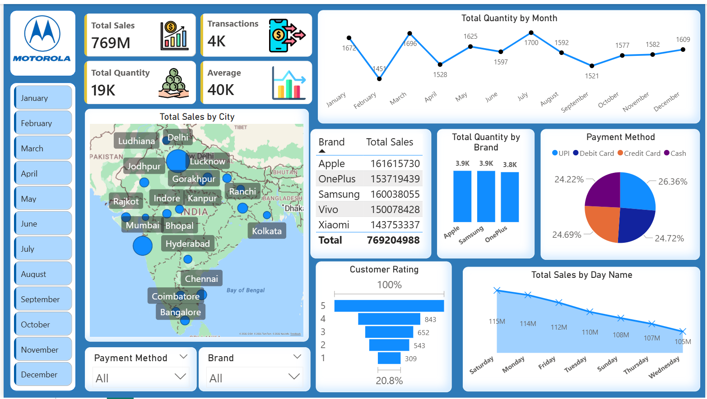

# Mobile Sales Data Power BI

## Overview
Interactive mobile sales dashboard built in Power BI to analyze revenue (769M), transactions (4K), and quantity sold (19K). The dashboard visualizes sales trends by month, city, brand, and day name. It also includes payment method insights, customer ratings, and interactive filters for deeper analysis. Designed to uncover sales patterns and support data-driven decision-making.

## Dashboard Features
- Total Sales Analysis
- Brand-wise Sales Performance
- Monthly Quantity Trends
- City-wise Sales Mapping
- Customer Rating Insights
- Payment Method Distribution

## Brands Included
- Apple
- Samsung
- OnePlus
- Vivo
- Xiaomi

## Tools Used
- Power BI
- Excel
- DAX
- Data Visualization

## Dashboard Preview

## Author
Sachin Saxena

[Linkedin Profile](https://www.linkedin.com/in/sachin-saxena-18b498219/)
